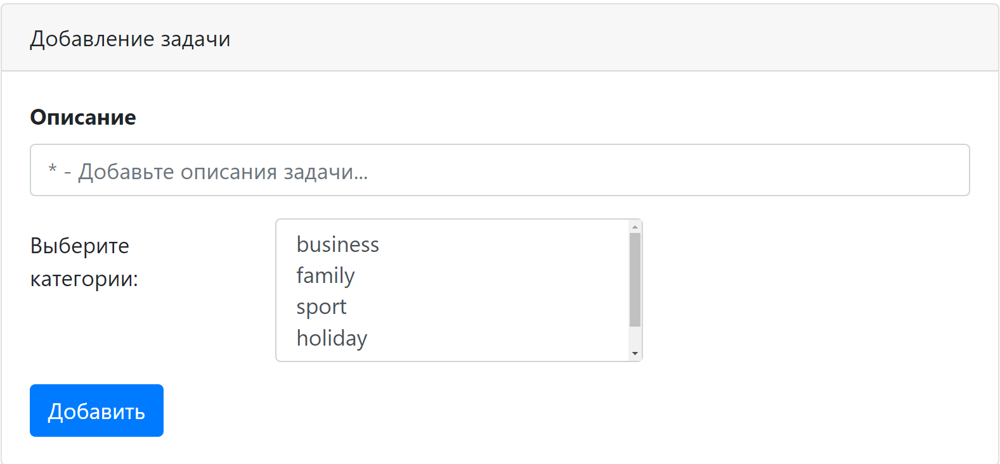
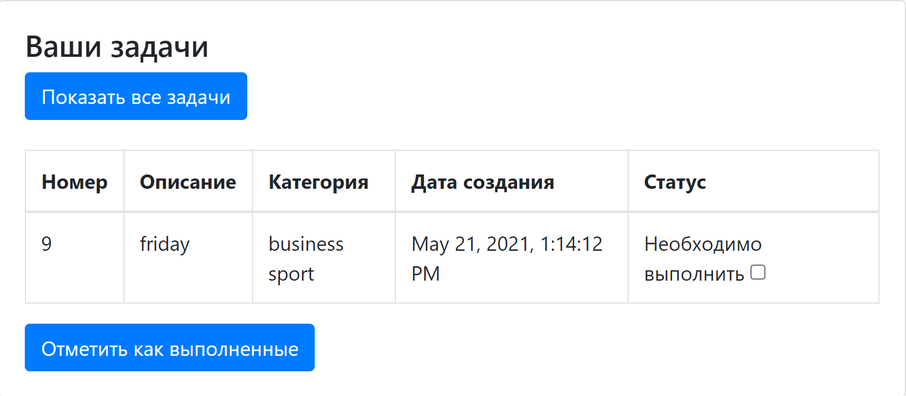

### Веб-приложение для контроля рабочих задач

Технологии:

Java Servlet API

Hibernate

JavaScript (jQuery, Ajax), HTML

Apache Tomcat

PostgreSQL

Log4j, Sl4J 

Maven

Travis CI, CodeCov, CheckStyle

### Страница списка задач

